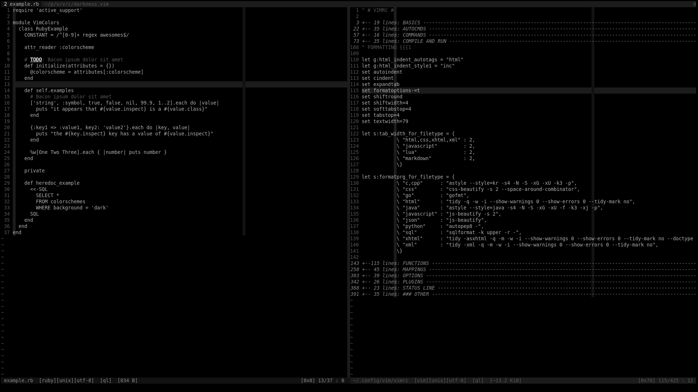

# Black&White Vim Colorscheme

Simple dark Vim colorscheme focused on black and white with occasional color accents when needed.




## Installation

For a basic install simply copy the color scheme file to your `~/.vim/colors` directory.

For full support in which the airline theme is available, install using Pathogen, Plug, Vundle or your favorite Vim package manager.


## Usage

Just like any other color scheme:

```vim
colorscheme black_and_white
```
